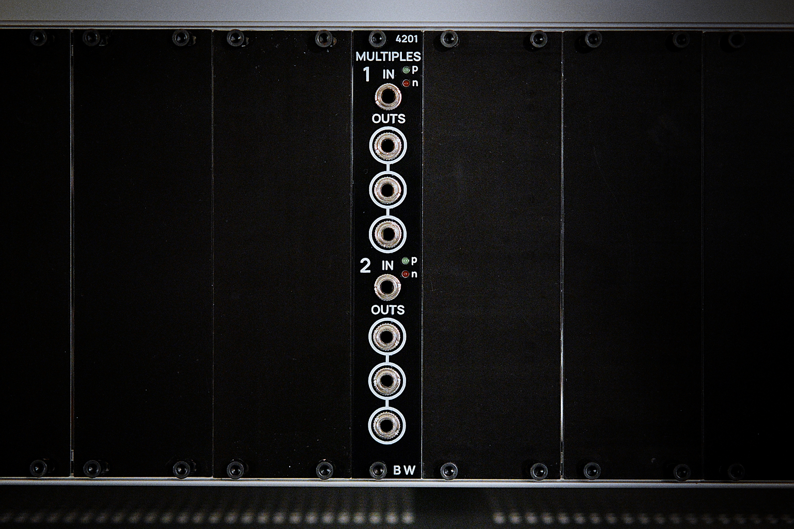

# 4201_multiples

## Overview
The 4201 module contains two buffered 1:3 multiples at a width of 4HP. It works with both audio and CV, draws minimal current and uses only readily available, run-of-the-mill components. Special LED indicator lights give visual feedback about polarity and intensity of any signal going through the module and serve as a simple oscilloscope.  

This is an open hardware project. The repository contains all design files as well as gerbers to order PCBs directly from a manufacturer like [PCBWay.com](https://pcbway.com/), who kindly supplied prototyping boards for the development of this module.  

### Size
__Width:__ 4 HP  
__Depth:__ 4.5 cm
### Power
__Connector:__ 10-pin  
__Current:__  
3 mA @ +12 V  
3 mA @ -12 V  

## How to build?

Upload the *.zip* in the `gerber_files/` folder to your PCB manufacturer's website to order.

An interactive html BOM is available in the `bom/` folder inside of the KiCad project. Just open it in a browser and tick off sourced/placed components.  
Also shows where on the board components should be placed.  

## Component availability / choices

No unobtainium in this project. All components should be easily sourced. All SMT devices on the board are SOIC or 12106 and can be easily handsoldered. (0805 or miniMELF / SOD-80 packages can be used as replacements.)

## Contact

Any questions?   

🡢 contact[at]butchwarns.de

## License

*(TODO: Find appropriate open-hardware license!)*

> Until otherwise stated here, the project is default licensed as proprietary.
